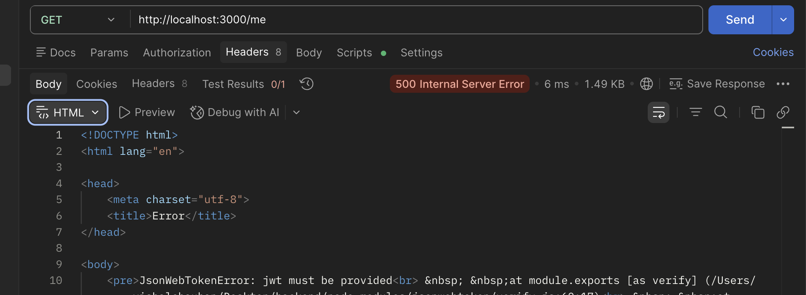

# Day 04 - JWT AUTHMIDDLEWARE (Bug solving)

**Date:** 17-june-2026  
**Topic:** problem solving

---
## 🎯 what i planned to Do
- I will be solving tomorrows problem as stated.
> `How i will do that its written in my Day-04-problemsolving(resumed).js file`
-   

## Problems to be solved  

> In tomorrow's code their were some bugs in the responding style of server.  

`NOTE:Both have same error` 

**1st:-When user is hitting "/me" endpoint directly after hitting "/signUp" then an error is appearing**  

**2nd:- When user is hitting "/me" endpoint directly before hitting any other routes(/signUp or /signIn)**  
   

## What i actually learned  
 - 
 - 

## Questions I still  have
**✅: means got answer**  
**➡️:will got answer in upcoming concepts**  
**❓Answer to be found**

- none
- none
- none

## To be found answers or some extra information if have !  
- none
    
      
        
          

             

